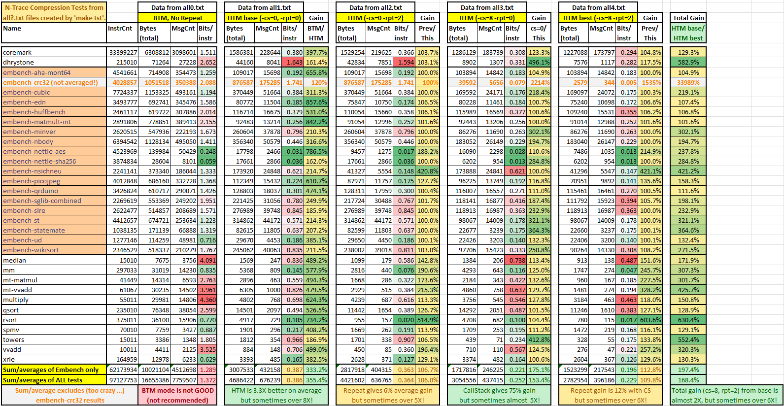

# N-Trace Compression Tests

This directory includes everything to re-run these tests on an Ubuntu system. The third-party
benchmark inputs (RISC-V ELF binaries and Spike PC traces) are **not committed** — fetch them once
with `./from_etrace/fetch.sh` (see [from_etrace/README.md](./from_etrace/README.md) for details and
licenses).

## Results 

## Notes
* Average HTM mode compression is **better than 0.2 bits/instruction** (but often much better!).
* Above results are consolidated from `all0.txt ... all4.txt` files (obtained by running `make tst`).
* Columns showing `Bits/instr` are color-shaded from red to green to highlight tests with worst/best compression.
* Columns showing `Gain` are color-shaded from yellow to green to highlight tests which gain the most.
* **HTM mode provides 3.3X improvement** over BTM mode (**BTM mode is not recommended**).
* Call-stack with 8 levels (implicit return) and repeated history provides **almost 2X gain over base HTM mode**.

## Files
    +-- README.md                   - This file
    +-- all.txt                     - Created by running 'make all'
    +-- all0.txt                    - Created by running 'make tst' (base for `n-trace-compression.xlsx` file)
    +-- all1.txt
    +-- all2.txt
    +-- all3.txt
    +-- all4.txt
    +-- n-trace-compression.xlsx    - Manually created Excel file with compression summary (from all0-all4.txt files)
    +-- n-trace-compression.png     - Image with compression results (for easier viewing)
    +-- makefile                    - Main makefile (to run tests - see below)
    +-- output                      - Directory for output files
    |    +-- README.md
    +-- from_etrace                 - Third-party benchmark inputs (fetched on demand, NOT committed)
        +-- README.md               - Procurement + license/attribution details
        +-- fetch.sh                - Reconstructs the inputs from upstream (run this first)
        +-- spike
        |   +-- spike.tar.gz        - PC sequences from spike (generated by fetch.sh, git-ignored)
        +-- test_files
            +-- *.riscv             - RISC-V ELF files (copied by fetch.sh, git-ignored)

(Running `make tst >makelog.txt` writes a local build log; `makelog.txt` is git-ignored.)

## Typical Usage
* `./from_etrace/fetch.sh` - Fetch benchmark inputs once (required before the targets below)
* `make`              - Run best compression test (statistics in all.txt file)
* `make tst`          - Run all 5 test configurations (all statistics in all?.txt files)
* `make clear`        - Clean all temporary files
